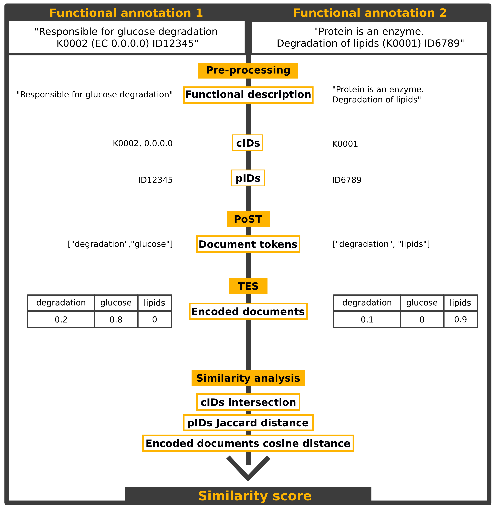

# UniFunc

UniFunc is a text mining tool that processes and analysis text similarity between a pair of protein function annotations.
It is mainly used as a cross-linking mechanism or redundancy elimination tool when processing annotations without any sort of database identifiers.

## Citing UniFunc

Please cite https://doi.org/10.1515/hsz-2021-0125 when using UniFunc.

## Setting up UniFunc

UniFunc only requires python (developed with python 3.9) and the python package NLTK, both can be installed with conda by executing:

`conda install python`

`conda install -c anaconda nltk `

If you prefer a conda environment is also provided `unifunc_env.yml`, to install it run:

`conda env create -f unifunc_env.yml`

## Using UniFunc
UniFunc can be run in two modes:

The default mode returns the similarity score (float) between the provided strings, to run it use:

`python UniFunc "this is string1" "this is string2"`

The secondary mode requires the user to set a threshold (e.g. 0.95) with the argument `-t`, and True will be returned if the string similarity is above the threshold, and False otherwise. To run it use:

`python UniFunc string1 string2 -t 0.95`

To use verbose mode add the argument `-v`, to redirect output to a file, add the argument `-t file_path`

To run a sample execution use: `python UniFunc --example`

##### To update corpus:
1. Delete all files in `UniFunc/Resources/`
2. Go to https://www.uniprot.org/uniprot/?query=reviewed 
3. Search for all protein entries
4. Choose the columns `Entry`,`Protein names`,and `Function [CC]`
5. Apply columns
6. Download results in tab separated format
7. Check if download file has these 3 headers: `Entry	Protein names	Function [CC]`
8. Rename the downloaded file to `uniprot.tab` and move it `UniFunc/Resources/`
9. Go to http://geneontology.org/docs/download-ontology/
10. Download `go.obo`
11. Move the file`go.obo` to `UniFunc/Resources/`

Here's an overview of the UniFunc workflow:

## How does UniFunc work?

The natural language processing of functional descriptions entails several steps:
1. Text pre-processing:
    - Split functional descriptions into documents
    - Remove identifiers
    - Standardize punctuation
    - Remove digits that are not attached to a token
    - Standardize ion patterns
    - Replace Roman numerals with Arabic numerals
    - Divide document into groups of tokens
    - Unite certain tokens (for example: “3” should be merged with “polymerase 3”)
2. [Part-of-speech tagging](#part-of-speech-tagging)  
    - pos_tag with [universal tagging](https://explosion.ai/blog/part-of-speech-pos-tagger-in-python) (contextual)
    - [Wordnet](https://wordnet.princeton.edu/) tagging (independent)
    - Choose best tag (Wordnet takes priority)
    - Removal of unwanted tags (determiners, pronouns, particles, and conjunctions)
3. [Token scoring](#token-scoring)
    - Try to find synonyms (wordnet lexicon) shared between the 2 compared documents
    - Build Term frequency- Inverse Document Frequency vectors (TF-IDF)
4. [Similarity analysis](#similarity-analysis)
    - Calculate cosine distance between the two scaled vectors
    - Calculate Jaccard distance between the two sets of identifiers
    - If similarity score is above the 0.8 consider, it a match

### Part-of-speech tagging

Part-of-speech tagging (POST) is the method of lexically classifying tokens based on their definition and context. In the context of this application, the point is to eliminate tokens that are not relevant to the similarity analysis.  
After pre-processing, tokens are tagged with a custom tagger [SequentialBackOffTagger](https://kite.com/python/docs/nltk.SequentialBackoffTagger) independent of context. This tagger uses [Wordnet’s lexicon](https://wordnet.princeton.edu/) to identify the most common lexical category of any given token.  
Should a token be present in Wordnet’s lexicon, a list of synonyms and their lexical category is generated, for example:  

`[(token,noun),(synonym1,noun) ,(synonym2,verb),(synonym3,adjective),(synonym4,noun)]`

The token is then assigned the most common tag **noun**.  

To adjust this lexicon to biological data, [gene ontology](http://purl.obolibrary.org/obo/go.obo) tokens are also added.  
Untagged tokens are then contextually classified with a [Perceptron tagger](http://wiki.apertium.org/wiki/Perceptron_tagger). The classification obtained from this tagger is not optimal (as a pre-trained classifier is used), however, in the current context this is barely of consequence, as this tagger is merely used as a backup when no other tag is available. Optimally a new model would be trained, but unfortunately this would require heavy time-investment in building a training dataset.  
The tokens tagged as being determiners, pronouns, particles, or conjunctions are removed.

### Token scoring

In this step, tokens are scored based on the “Term frequency- Inverse Document Frequency” technique. This allows the analysis on which tokens are more relevant to a certain annotation, which in turn allows for the identification of other annotations with the same similarly important tokens.

TF-IDF measures the importance of a token to a document in a corpus. To summarize:
- TF - Tokens that appear more often in a document should be more important. This is a local (document wide) metric.
- IDF - tokens that appear in too many documents should be less important. This is a global (corpus wide) metric.

TF-IDF is calculated with the following equation:

- NT, times token appears in document
- TT, total amount of tokens in document
- TD, total amount of documents
- DT, total amount of times a certain token appears in a document – frequency table

The corpus used to build this metric were all the 561.911 reviewed proteins from Uniprot (as of 2020/04/14). After pre-processing, each protein annotation is split into tokens, and a token frequency table (DT) is calculated and saved into a file.

The TF-IDF score is then locally scaled (min_max scaling relative to the document) so that we can better understand which tokens are more relevant within the analysed document.

### Similarity analysis

Finally, we can then compare annotations from different sources, by calculating the [cosine distance](https://en.wikipedia.org/wiki/Cosine_similarity) between each pair of TF-IDF scaled vectors. Should the tokens they contain and their importance within the document be around the same, the annotations are classified as “identical”.
Identifiers within the free-text description are also taken into account, via the [Jaccard distance metric](https://en.wikipedia.org/wiki/Jaccard_index). A simple intersection is not used as more general identifiers might lead to too many false positives.

### Consensus construction

In this manner we are able to construct groups of hits (from different sources) that match between either via identifiers or free-text descriptions. We then evaluate the quality of each group of consensuses and select the best one, taking into account:  
- Percentage of the sequence covered by the hits in the consensus
- Significance of the hits (e-value) in the consensus
- Significance of the reference datasets
- Number of different reference datasets in the consensus

